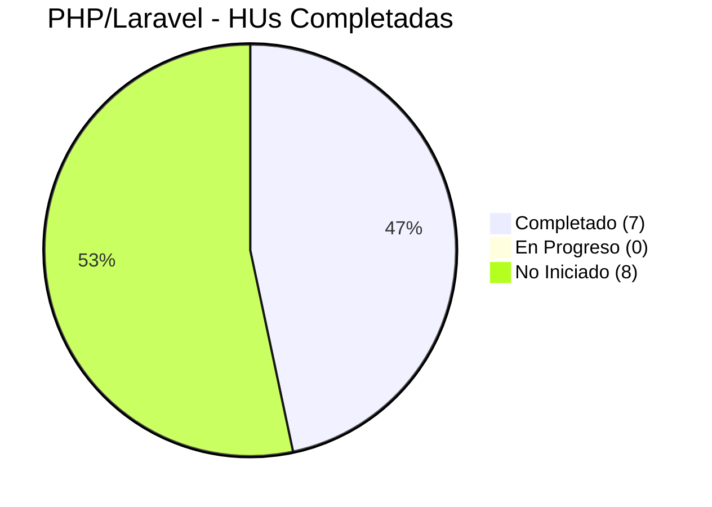
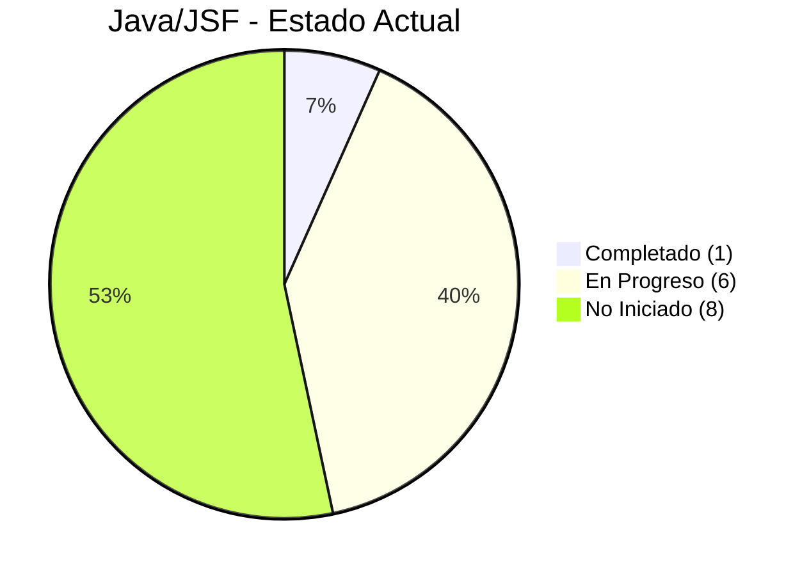
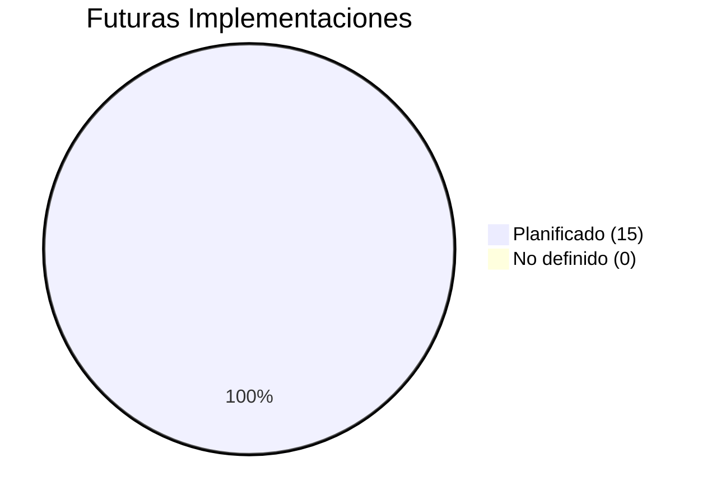

# **Hotel La J Elegante - Sistema de Gestión Hotelera**


## 🚀 Tabla de Contenidos
1. [Descripción del Proyecto](#-descripción-del-proyecto)
2. [Stack Tecnológico](#-stack-tecnológico)
3. [Estado del Proyecto](#-estado-del-proyecto)
4. [Estructura del Repositorio](#-estructura-del-repositorio)
5. [Instalación y Configuración](#-instalación-y-configuración)
6. [Documentación Técnica](#-documentación-técnica)
7. [Equipo y Contribuciones](#-equipo-y-contribuciones)
8. [Rutas de Aprendizaje](#-rutas-de-aprendizaje)
9. [Licencia](#-licencia)

## 📋 Descripción del Proyecto
**Problema Académico que Resolvemos:** Como proyecto educativo, identificamos un escenario común en la hotelería: la gestión manual y dispersa de reservas que lleva a errores operativos, sobreocupación y mala experiencia del cliente. Decidimos crear "La J Elegante", un hotel ficticio, para desarrollar una solución tecnológica completa.

**Objetivo del Sistema:** Centralizar y optimizar la gestión de reservas, operaciones y administración del hotel, eliminando la dispersión de información causada por la gestión manual y mejorando la eficiencia operativa.

**Características Clave:**
- Gestión de reservas de habitaciones y restaurantes
- Administración de usuarios con roles y permisos diferenciados
- Configuración de tarifas y políticas dinámicas
- Dashboard administrativo con métricas (Chart.js)

**Metas de Eficiencia:** Reducir en un 80% los errores operativos mediante automatización.

**📝 Nota Académica:** Este es un proyecto educativo desarrollado por estudiantes de tecnología. La empresa "Hotel La J Elegante" es ficticia, creada para aplicar conocimientos de desarrollo web en un contexto realista. El problema a resolver fue planteado por el equipo como ejercicio de análisis de sistemas.

## 🛠 Stack Tecnológico
### **Tecnologías Comunes a Todas las Implementaciones**
- **Frontend:** Bootstrap 5 (estilos responsivos), Chart.js (gráficos y métricas)
- **Patrón de Diseño:** MVC (Model-View-Controller)
- **Base de Datos:** MySQL (principal), con posibilidad de adaptación
- **Control de Versiones:** Git + GitHub

### **Implementaciones Activas**
| Lenguaje | Framework | Versión | Estado | Dependencias Principales |
|----------|-----------|---------|--------|--------------------------|
| Java | Jakarta EE (JSF 2.1) | Java EE 7, GlassFish | 🔄 **En Desarrollo** | PrimeFaces, MySQL Connector, Ant |
| PHP | Laravel | 10.x (PHP 8.2) | 🔄 **En Desarrollo** | dompdf, Laravel Excel, Eloquent ORM |
| Python | Por definir | Por definir | ⏳ **Planificado** | - |
| C# | Por definir | Por definir | ⏳ **Planificado** | - |

## 📈 Estado del Proyecto
**Progreso General: 37.5%** - Fase de CRUDs básicos en desarrollo

### **📝 Sistema de Tracking para el Equipo**

**¿Cómo actualizar nuestro progreso?**
1. Busca tu HU en las tablas abajo
2. Encuentra la columna de tu lenguaje
3. Actualiza el emoji según:
   - 🟢 **Completado** = "Funciona en mi máquina y pruebas OK"
   - 🟡 **En Progreso** = "Estoy trabajando activamente"
   - 🔴 **No Iniciado** = "Aún no empiezo"
   - 🔍 **En Revisión** = "Decidiendo si implementar"
   - 📅 **Futuro** = "Para otro trimestre"

**Ejemplo de actualización:**
```diff
- | HU-003 | 🟡 60% | 🔴 0% |
+ | HU-003 | 🟢 100% | 🟡 40% |
```
---

### **📋 Historias de Usuario - Vista Consolidada por Módulo**

| Módulo | ID | Historia de Usuario | Estado Global | Categoría |
|--------|----|---------------------|---------------|-----------|
| **Usuarios** | HU-001 | Crear y modificar usuarios | 🟡 **Parcial** | ✅ Confirmada |
| **Usuarios** | HU-002 | Consultar roles y usuarios | 🟡 **Parcial** | ✅ Confirmada |
| **Habitaciones** | HU-003 | Gestionar habitaciones | 🟡 **Parcial** | ✅ Confirmada |
| **Habitaciones** | HU-004 | Definir tarifas | 🟡 **Parcial** | ✅ Confirmada |
| **Reservas** | HU-005 | Reservar manualmente (fallback) | 🟡 **Parcial** | ✅ Confirmada |
| **Restaurante** | HU-006 | Gestionar mesas | 🟡 **Parcial** | ✅ Confirmada |
| **Restaurante** | HU-007 | Gestionar reservas restaurante | 🟡 **Parcial** | ✅ Confirmada |
| **Facturación** | HU-008 | Generar facturas | 🔴 **No Iniciado** | ✅ Confirmada |
| **Facturación** | HU-009 | Gestionar facturas existentes | 🔴 **No Iniciado** | ✅ Confirmada |
| **Analíticas** | HU-010 | Relación reservas/mesas | 🔴 **No Iniciado** | ✅ Confirmada |
| **Analíticas** | HU-011 | Relación reservas/habitaciones | 🔴 **No Iniciado** | ✅ Confirmada |
| **Analíticas** | HU-012 | Relación facturas/servicios | 🔴 **No Iniciado** | ✅ Confirmada |
| **Sistema** | HU-013 | Backups de base de datos | 🔴 **No Iniciado** | ❌ Descartada |
| **Sistema** | HU-014 | Políticas de descuento | 🔴 **No Iniciado** | ✅ Simplificada |
| **Sistema** | HU-015 | Manual de usuario | 🔴 **No Iniciado** | 📅 Baja prioridad |

---

### **🔍 Detalle de Implementación Multi-Lenguaje**

#### **Módulo Habitaciones**  
| Historia | Rol | Descripción | PHP/Laravel | Java/JSF | Python* | C#* |
|----------|-----|-------------|-------------|----------|---------|-----|
| **HU-003** | Administrador | CRUD completo habitaciones | 🟢 100% | 🟡 60% | ⏳ | ⏳ |
| **HU-003B** | Gerente General | Consulta y aprobación | 🔴 0% | 🔴 0% | ⏳ | ⏳ |
| **HU-003C** | Recepcionista | Solo consulta estado | 🔴 0% | 🔴 0% | ⏳ | ⏳ |
| **HU-004** | Administrador | Definir tarifas | 🟢 100% | 🟡 60% | ⏳ | ⏳ |

#### **Módulo Restaurante**
| Historia | Rol | Descripción | PHP/Laravel | Java/JSF | Python* | C#* |
|----------|-----|-------------|-------------|----------|---------|-----|
| **HU-006** | Administrador | CRUD mesas | 🟢 100% | 🟡 60% | ⏳ | ⏳ |
| **HU-007** | Administrador | CRUD reservas restaurante | 🟢 100% | 🟡 60% | ⏳ | ⏳ |
| **HU-007B** | Cliente | Autoservicio web | 🔴 0% | 🔴 0% | ⏳ | ⏳ |

#### **Módulo Usuarios**
| Historia | Rol | Descripción | PHP/Laravel | Java/JSF | Python* | C#* |
|----------|-----|-------------|-------------|----------|---------|-----|
| **HU-001** | Administrador | CRUD usuarios | 🟢 100% | 🟢 100% | ⏳ | ⏳ |
| **HU-002** | Administrador | Consultar usuarios | 🟢 100% | 🟡 60% | ⏳ | ⏳ |
| **HU-001B** | Usuario | Autoconsulta perfil | 🔴 0% | 🔴 0% | ⏳ | ⏳ |

#### **Módulo Facturación (Futuro)**
| Historia | Rol | Descripción | PHP/Laravel | Java/JSF | Python* | C#* |
|----------|-----|-------------|-------------|----------|---------|-----|
| **HU-008** | Administrador | Generar facturas | 🔴 0% | 🔴 0% | ⏳ | ⏳ |
| **HU-009** | Administrador | Gestionar facturas | 🔴 0% | 🔴 0% | ⏳ | ⏳ |
| **HU-008B** | Cliente | Ver mis facturas | 🔴 0% | 🔴 0% | ⏳ | ⏳ |

---

### **📊 Progreso por Lenguaje**

#### **PHP/Laravel**  


**Resumen:** 7/15 HUs implementadas
**Detalle:** ✅ Todos los CRUDs básicos terminados

#### **Java/JSF**  


**Resumen:** 1/15 HUs completadas, 6 en progreso
**Detalle:** 🟡 Módulos principales por implementar

#### **Python y C#**  


---

### **🗂️ Estructura Jerárquica Completa por Rol**

**📁 ADMINISTRADOR**
```
├── 📂 MÓDULO USUARIOS
│   ├── HU-001: Crear y modificar usuarios dentro del sistema
│   │   ├── HU-001A: Crear usuario nuevo (formulario + validaciones)
│   │   ├── HU-001B: Modificar usuario existente (con confirmación)
│   │   └── HU-001C: Archivar/desarchivar usuario (doble confirmación)
│   └── HU-002: Realizar consultas de roles y usuarios
│       ├── HU-002A: Listar usuarios (orden alfabético)
│       └── HU-002B: Mostrar "sin resultados" cuando no hay datos
│
├── 📂 MÓDULO HABITACIONES
│   ├── HU-003: Crear y modificar habitaciones del sistema
│   │   ├── HU-003A: Crear nueva habitación
│   │   ├── HU-003B: Modificar habitación existente
│   │   └── HU-003C: Archivar/desarchivar habitación
│   └── HU-004: Definir tarifas de las habitaciones
│       ├── HU-004A: Crear nueva tarifa
│       ├── HU-004B: Modificar tarifa existente
│       └── HU-004C: Retirar/activar tarifa
│
├── 📂 MÓDULO RESERVAS
│   └── HU-005: Reservar manualmente (soporte para fallos)
│       ├── HU-005A: Crear reserva manual
│       ├── HU-005B: Modificar reserva existente
│       └── HU-005C: Cancelar reserva
│
├── 📂 MÓDULO RESTAURANTE
│   ├── HU-006: Crear y modificar mesas del restaurante
│   │   ├── HU-006A: Crear nueva mesa
│   │   ├── HU-006B: Modificar mesa existente
│   │   └── HU-006C: Retirar/activar mesa
│   └── HU-007: Gestionar reservas del restaurante
│       ├── HU-007A: Crear reserva de mesa
│       ├── HU-007B: Modificar reserva de mesa
│       └── HU-007C: Cancelar reserva de mesa
│
├── 📂 MÓDULO FACTURACIÓN *(Futuro)*
│   ├── HU-008: Generar facturas de servicios del hotel
│   │   ├── HU-008A: Generar factura exitosa
│   │   └── HU-008B: Manejar conflicto en generación
│   └── HU-009: Gestionar facturas existentes
│       ├── HU-009A: Listar facturas
│       └── HU-009B: Mostrar "sin facturas" cuando no hay
│
├── 📂 MÓDULO ANALÍTICAS *(Futuro)*
│   ├── HU-010: Ver relación reservas y mesas disponibles
│   │   ├── HU-010A: Listar mesas con estados de reserva
│   │   └── HU-010B: Mostrar "sin reservas en mesas"
│   ├── HU-011: Ver relación reservas y habitaciones con tarifas
│   │   ├── HU-011A: Listar habitaciones con estados y tarifas
│   │   └── HU-011B: Mostrar "sin reservas en habitaciones"
│   └── HU-012: Ver relación facturas y servicios consumidos
│       ├── HU-012A: Listar facturas por servicio
│       └── HU-012B: Mostrar "sin facturas"
│
└── 📂 MÓDULO SISTEMA
    ├── HU-013: ❌ DESCARTADA - Backups de base de datos
    ├── HU-014: Políticas de descuento y promociones
    │   ├── HU-014A: Crear política
    │   ├── HU-014B: Activar política
    │   └── HU-014C: Desactivar política
    └── HU-015: 📅 MANUAL DE USUARIO (PDF final)
        ├── HU-015A: Descargar manual exitosamente
        └── HU-015B: Manejar error en descarga
```

**📁 GERENTE GENERAL**
```
├── 📂 HABITACIONES
│   ├── HU-003B: Modificar habitaciones existentes
│   └── HU-004B: Modificar tarifas existentes
│
├── 📂 ANALÍTICAS
│   └── HU-011B: Reportes PDF de reservas vs habitaciones
│
└── 📂 SISTEMA
    └── HU-014: Gestionar políticas de descuento
        ├── HU-014B: Activar políticas
        └── HU-014C: Desactivar políticas
```

**📁 GERENTE DE HABITACIONES**
```
└── 📂 HABITACIONES
    └── HU-003D: Actualizar estado de mantenimiento de habitaciones
        ├── HU-003D1: Marcar habitación en mantenimiento
        └── HU-003D2: Liberar habitación de mantenimiento
```

**📁 RECEPCIONISTA**
```
├── 📂 HABITACIONES
│   └── HU-003C: Consultar estado de habitaciones
│
├── 📂 RESERVAS
│   ├── HU-005A: Crear reservas manuales
│   ├── HU-005B: Modificar reservas existentes
│   └── HU-005C: Cancelar reservas
│
├── 📂 RESTAURANTE
│   ├── HU-006C: Consultar estado de mesas
│   ├── HU-007A: Crear reservas de mesa
│   ├── HU-007B: Modificar reservas de mesa
│   └── HU-007C: Cancelar reservas de mesa
│
└── 📂 FACTURACIÓN
    └── HU-008A: Generar facturas para servicios
```

**📁 CLIENTE / HUÉSPED**
```
├── 📂 RESERVAS
│   ├── HU-005C: Reservar habitación online
│   └── HU-005B: Modificar mi reserva
│
├── 📂 RESTAURANTE
│   ├── HU-007A: Reservar mesa online
│   └── HU-007B: Modificar mi reserva de mesa
│
└── 📂 FACTURACIÓN
    └── HU-009A: Consultar mis facturas
```

---

### **🗓️ Objetivos por Trimestre (Histórico y Planificado)**

#### **📅 TRIMESTRE 3B (Abril-Julio 2025)**
*Equipo no existente*

| Objetivo | Detalles |
|----------|----------|
| **Formulación del proyecto** | Definición del producto a trabajar |
| **Investigación de mercado** | Defenir estandares, reglas de negocio y area de ganancia |
| **Selección de tecnologías** | Decisión de enfoque multi-lenguaje con especialización |
| **Creacion de base de datos** | Script, Triggers y Procedimientos almacenados |

---

#### **📅 TRIMESTRE 4B (Julio-Octubre 2025)**
*Fase de planificación y despliegue en PHP/Laravel*

**✅ OBJETIVOS CUMPLIDOS (Criterios de Evaluación):**

| # | Objetivo Específico | Cumplido | Evidencia | Notas |
|---|---------------------|----------|-----------|-------|
| 1 | Autenticación y manejo dinámico de roles | ✅ SI | Sistema de login con middleware | Roles: Admin, Recepcionista, Cliente |
| 2 | CRUD con validaciones de formularios | ✅ SI | 7 módulos CRUD implementados | *Faltan validaciones específicas* |
| 3 | Reportes con filtros multicriterio | ✅ SI | Listados con búsqueda, ordenamiento y filtros multicriterio | Eloquent en PHP |
| 4 | Criterios de usabilidad y navegabilidad | ✅ SI | Bootstrap 5, navegación intuitiva | *Revisar objetivos generales* |
| 5 | Uso de repositorio y versionamiento | ✅ SI | GitHub | - |
| 6 | Implementación con Frameworks | ✅ SI | Laravel 12 | MVC, Eloquent ORM, Blade |

**📊 PORCENTAJE DE PROYECTO EN ESTE TRIMESTRE: 47%**
- ✅ PHP/Laravel: 7/15 HUs completadas

---

#### **📅 TRIMESTRE 5B (Octubre-Diciembre 2025)**
*Implementación en Java/JSF*

**🎯 OBJETIVOS CUMPLIDOS:**

| # | Objetivo Específico | Cumplido | Evidencia | Notas |
|---|---------------------|----------|-----------|-------|
| 1 | Autenticación y manejo dinámico de roles | ✅ SI | Sistema de login | - |
| 2 | CRUD con validaciones de formularios | ✅ SI | 1 módulo CRUD implementado | - |
| 3 | Reportes con filtros multicriterio | ✅ SI | Listados con búsqueda, ordenamiento y filtros multicriterio | - |
| 4 | Criterios de usabilidad y navegabilidad | ✅ SI | Bootstrap 5, navegación intuitiva, Primefaces | - |
| 5 | Uso de repositorio y versionamiento | ✅ SI | GitHub con ramas organizadas | - |
| 6 | Implementación con Frameworks | ✅ SI | JSF 2.3 | MVC, JDBC, XHTML |

**📊 PORCENTAJE DE PROYECTO EN ESTE TRIMESTRE: 28%**
- ✅ Java/JSF: 1/15 HUs completadas

---

#### **📅 TRIMESTRE 6B (Enero-Abril 2026) - PLANIFICADO**
*Tercer lenguaje (Python o C#) - Por definir*

**🎯 OBJETIVOS CUMPLIDOS:**

**📊 PORCENTAJE DE PROYECTO EN ESTE TRIMESTRE: ?%**

---

#### **📅 TRIMESTRE 7B (Abril-Julio 2026) - PLANIFICADO**
*Cuarto lenguaje (Python o C#) - Por definir*

**🎯 OBJETIVOS CUMPLIDOS:**

**📊 PORCENTAJE DE PROYECTO EN ESTE TRIMESTRE: ?%**

---

### **📈 RESUMEN DE EVOLUCIÓN**

| Trimestre | Lenguaje | % Proyecto | HUs Completadas | Estado |
|-----------|----------|------------|-----------------|--------|
| 3B 2025 | - | 0% | 0/15 | ⚪️ Sin Participacion |
| 4B 2025 | PHP/Laravel | 47% | 7/15 | 🟢 Completado |
| 5B 2025 | Java/JSF | 28%* | 1/15* | 🟢 Completado |
| 6B 2026 | ¿Python/C#? | ?%* | ?/15* | 🔵 Planificado |
| 7B 2026 | ¿Python/C#? | ?%* | ?/15* | 🔵 Planificado |

---

### **📈 Métricas del Proyecto**

**Progreso Total:** 37.5%  
**HUs por Estado:**
- ✅ Confirmadas: 12 HUs
- ❌ Descartadas: 1 HU (HU-13)
- 📅 Baja prioridad: 1 HU (HU-15)
- 🔍 Simplificadas: 1 HU (HU-14)

**Distribución por Complejidad:**
- 🔵 **Baja:** CRUDs básicos (HU-1 a HU-7) - 28.57% completo
- 🟡 **Media:** Facturación (HU-8, HU-9) - 0% 
- 🔴 **Alta:** Analíticas (HU-10 a HU-12) - 0%
---

## 📁 Estructura del Repositorio
**Estrategia de Ramas:**
```
main/                      # Proyecto ACTUAL del trimestre
│
├── laravel/               # Rama principal para PHP/Laravel
│   ├── laravel-jeremy/    # Rama personal de Jeremy
│   └── ... (otros desarrolladores)
│
├── java/                  # Rama principal para Java/JSF
│   ├── java-jeremy/       # Rama personal de Jeremy
│   ├── java-julian/       # Rama personal de Julián
│   └── java-javier/       # Rama personal de Javier
│   
├── python/                # (Futuro) Rama para Python
│   ├── python-jeremy/       # Rama personal de Jeremy
│   ├── python-julian/       # Rama personal de Julián
│   └── python-javier/       # Rama personal de Javier
│
└── csharp/                # (Futuro) Rama para C#
    ├── csharp-jeremy/       # Rama personal de Jeremy
    ├── csharp-julian/       # Rama personal de Julián
    └── csharp-javier/       # Rama personal de Javier
```

### **📌 Importante: Estrategia de Ramas**
Este proyecto utiliza **ramas especializadas por lenguaje**. No uses la rama `main` directamente ya que rota según el trimestre académico.

## ⚙️ Instalación y Configuración

### **🟠 PHP/Laravel (Rama: `laravel`)**

#### **Requisitos Previos:**
- PHP 8.2 o superior
- Composer 2.5+
- MySQL 8.0+
- Git

#### **Pasos de Instalación:**
```bash
# 1. Clonar el repositorio y acceder a la rama laravel
git clone https://github.com/Xanderm0/LaJElegante.git
cd LaJElegante
git checkout laravel

# 2. Instalar dependencias de PHP
composer install

# 3. Configurar variables de entorno
cp .env.example .env
# ⚠️ EDITAR el archivo .env con tus credenciales:
# DB_DATABASE=hotellje
# DB_USERNAME=tu_usuario
# DB_PASSWORD=tu_contraseña

# 4. Generar clave de aplicación
php artisan key:generate

# 5. Crear la base de datos (ejecutar en MySQL)
CREATE DATABASE hotel_la_j_elegante CHARACTER SET utf8mb4 COLLATE utf8mb4_unicode_ci;

# 6. Ejecutar migraciones y seeders
php artisan migrate --seed

# 7. (Opcional) Instalar dependencias frontend
npm install && npm run build

# 8. Iniciar servidor de desarrollo
php artisan serve

# 9. Acceder en el navegador:
# 🌐 http://localhost:8000
```

#### **Credenciales de Prueba (creadas por seeders):**
- **Administrador:** admin@lajelegante.com / password123
- **Recepcionista:** recepcion@lajelegante.com / password123

---

### **🔵 Java/JSF (Rama: `java`)**

#### **Requisitos Previos:**
- Java JDK 11 o superior
- Apache NetBeans 13+ (recomendado)
- GlassFish Server 6.2+
- MySQL 8.0+
- Git

#### **Opción A: Con NetBeans (Recomendada)**
```bash
# 1. Clonar y cambiar a rama java
git clone https://github.com/Xanderm0/LaJElegante.git
cd LaJElegante
git checkout java

# 2. Abrir NetBeans y seleccionar:
#    File → Open Project → Seleccionar carpeta "java"

# 3. Configurar GlassFish Server:
#    - Services → Servers → Add Server
#    - Seleccionar GlassFish 6.2+
#    - Descargar si no está instalado

# 4. Configurar Base de Datos MySQL:
#    - Services → Databases → New Connection
#    - MySQL (Connector/J driver)
#    - Host: localhost, Port: 3306
#    - Database: hotellje -> puedes encontrar esta base de datos en el drive
#    - User: root (o tu usuario)

# 5. Ejecutar script SQL inicial:
#    Ubicación: /java/docs/database/init.sql
#    Ejecutar en MySQL Workbench o línea de comandos

# 6. Ejecutar proyecto:
#    Click derecho en proyecto → Run
#    🌐 http://localhost:8080/HotelLaJElegante/
```

#### **Opción B: Línea de Comandos**
```bash
# 1. Clonar repositorio
git clone -b java https://github.com/Xanderm0/LaJElegante.git
cd LaJElegante

# 2. Instalar Base de Datos MySQL:
#  hotellje -> puedes encontrar esta base de datos en el drive

# 3. Compilar con Ant (desde carpeta /java)
cd java
ant compile

# 4. Crear archivo WAR
ant war
# Se generará: dist/HotelLaJElegante.war

# 5. Desplegar en GlassFish manualmente:
# Copiar el .war a: [glassfish-install]/domains/domain1/autodeploy/

# 6. Iniciar GlassFish:
# [glassfish-install]/bin/asadmin start-domain

# 7. Acceder vía navegador:
# 🌐 http://localhost:8080/HotelLaJElegante/
```
## 📚 Documentación Técnica
### **Enlaces a Documentación Completa**
- **[Documentación General en Drive](https://drive.google.com/drive/folders/14hGh5fvlVhJBpGYN0-jRrzCacsubTl8S?usp=sharing)** - Requisitos, diagramas, planificación, reglas de negocio
- **Diagramas PlantUML:** Disponibles en `/java/docs/diagrams/` y `/laravel/docs/diagrams/`
- **Modelo de Datos:** Diagramas en cada carpeta `/docs/`

### **Decisiones de Arquitectura**
1. **Patrón MVC Estricto:** Separación clara entre lógica, datos y presentación
2. **Base de Datos Unificada:** Mismo esquema para todas las implementaciones, pequeñas variaciones entre lenguajes para implementar auditoria
3. **Bootstrap como Framework UI:** Consistencia visual entre implementaciones
4. **Chart.js para Analytics:** Gráficos unificados en dashboard administrativo

### **Diagramas Disponibles**
- Diagrama de Casos de Uso
- Diagrama de Clases (por lenguaje)
- Diagrama de Despliegue (por lenguaje)
- Diagrama de Base de Datos (ER) (por lenguaje y base inicial)
- Modelo Relacional
- Historias de Usuario

## 👥 Equipo y Contribuciones
### **Roles del Equipo Scrum**
| Nombre | Rol | Especialización | Ramas Principales |
|--------|-----|----------------|-------------------|
| **Jeremy Duarte** | SCRUM Master | Arquitectura, Coordinación | `laravel-jeremy`, `java-jeremy`, `python-jeremy`, , `csharp-jeremy` |
| **Julián Suárez** | Development Team | Backend, Lógica de Negocio | `java-julian`, `python-julian`, `csharp-julian` |
| **Javier Peñata** | Product Owner | Requisitos, Testing | `java-javier` , `python-javier`, `csharp-javier` |

### **Política de Contribución**
1. **Flujo de Trabajo:**
   - Cada desarrollador trabaja en su rama personal (`program-languaje-dev`)
   - Pull desde la rama principal del lenguaje trabajado (`program-languaje-dev` ← `program-languaje`)
   - Merge a la rama principal del lenguaje (`program-languaje-dev` → `program-languaje`)
   - Revisión por pares antes de merge a main

2. **Commits Semánticos:**
   ```bash
   feat: add reservation validation (HU-004)
   fix: correct date calculation in booking
   docs: update installation guide for Java
   refactor: optimize room availability query
   ```

3. **Visualización de Contribuciones:**
   - GitHub Insights: [https://github.com/Xanderm0/LaJElegante/graphs/contributors](https://github.com/Xanderm0/LaJElegante/graphs/contributors)
   - Cada rama personal muestra el trabajo individual

## 🎯 Rutas de Aprendizaje
**Como Estudiantes de Tecnología, Buscamos:**

### **Objetivos de Aprendizaje Técnico:**
- ✅ **Comparar Implementaciones:** MVC en Java EE vs Laravel
- 🔄 **Patrones de Diseño:** Aplicar Factory, Singleton, Strategy en contexto real
- 🔄 **ORM vs SQL Directo:** Experiencia con Eloquent (Laravel) y JDBC (Java)
- ⏳ **Despliegue Multi-Entorno:** Local, desarrollo, producción
- ⏳ **Integración Continua:** GitHub Actions para testing automático

### **Objetivos de Gestión de Proyectos:**
- ✅ **Metodología Scrum:** Roles, sprints, historias de usuario
- 🔄 **Control de Versiones:** Git avanzado (ramas, merges, conflictos)
- 🔄 **Documentación Profesional:** READMEs, wikis, diagramas técnicos
- ⏳ **Trabajo Colaborativo:** Code reviews, pair programming

### **Lecciones Aprendidas (Espacio para Reflexión)**
*"En esta fase inicial, descubrimos que la planeación de la base de datos es crítica antes de cualquier implementación. Un modelo de datos bien diseñado ahorra horas de refactorización."*

## 📄 Licencia
Este es un proyecto **académico educativo** sin licencia comercial. El código puede ser usado como referencia para fines de aprendizaje. 

**Restricciones:**
- No puede ser usado con fines comerciales
- Atribución a los autores requerida
- Sin garantías de ningún tipo

**Uso Académico Libre:** Profesores y estudiantes pueden usar, modificar y distribuir este código con propósitos educativos.

---

## ❓ Preguntas Frecuentes
**Q: ¿Por qué múltiples implementaciones del mismo sistema?**  
R: Como ejercicio académico, nos permite comparar enfoques, frameworks y mejores prácticas en diferentes ecosistemas tecnológicos.

**Q: ¿Cómo selecciono qué versión usar?**  
R: Depende de tu stack tecnológico familiar:
- Si conoces PHP → Usa la versión Laravel
- Si trabajas con Java EE → Usa la versión JSF
- Para aprendizaje → Recomendamos comparar ambas

**Q: ¿Dónde reporto bugs o sugiero mejoras?**  
 R: En la sección [Issues](https://github.com/Xanderm0/LaJElegante/issues) del repositorio.

---

**¿Necesitas ayuda?** Contacta al SCRUM Master: Jeremy Duarte o abre un issue en GitHub.

---
